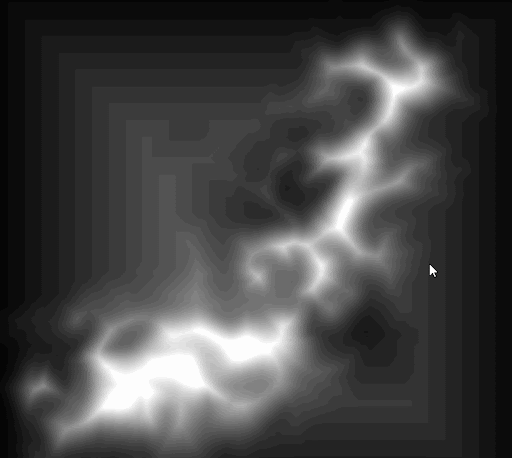
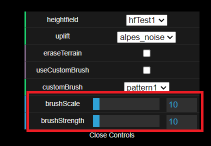
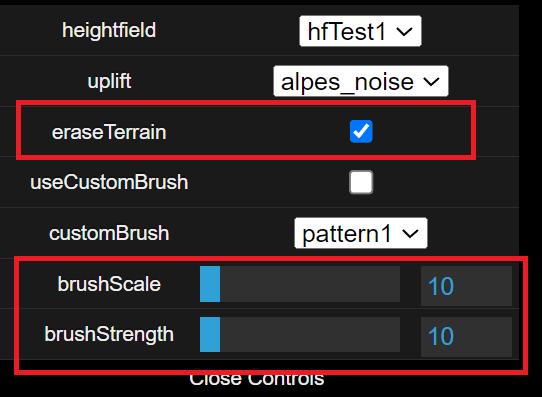
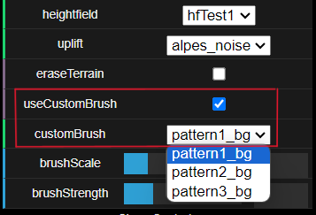
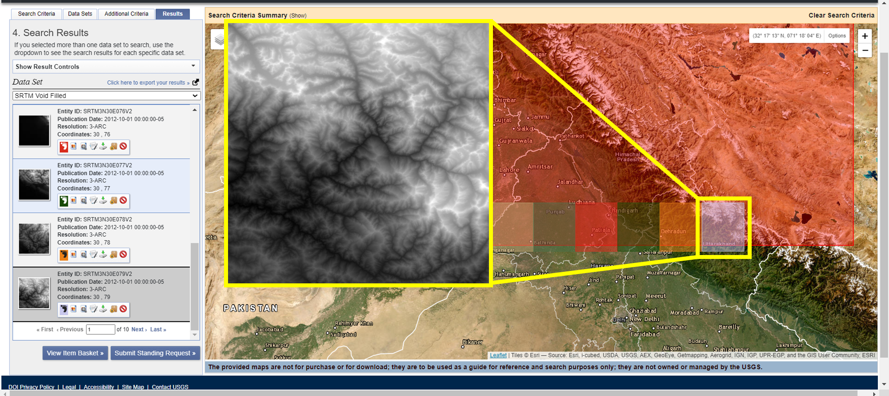
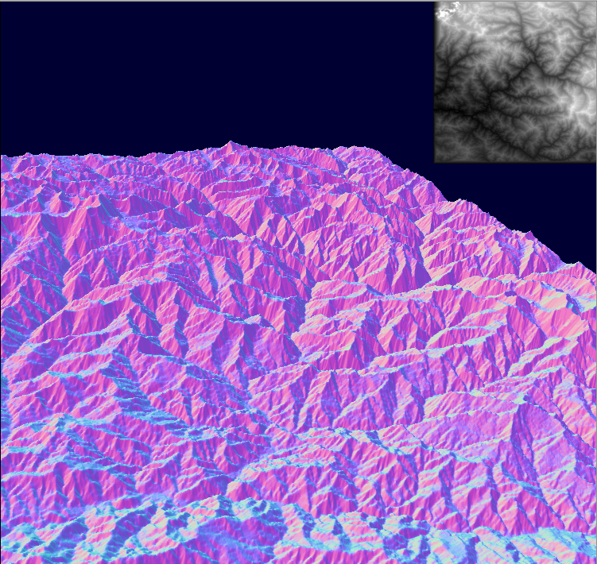
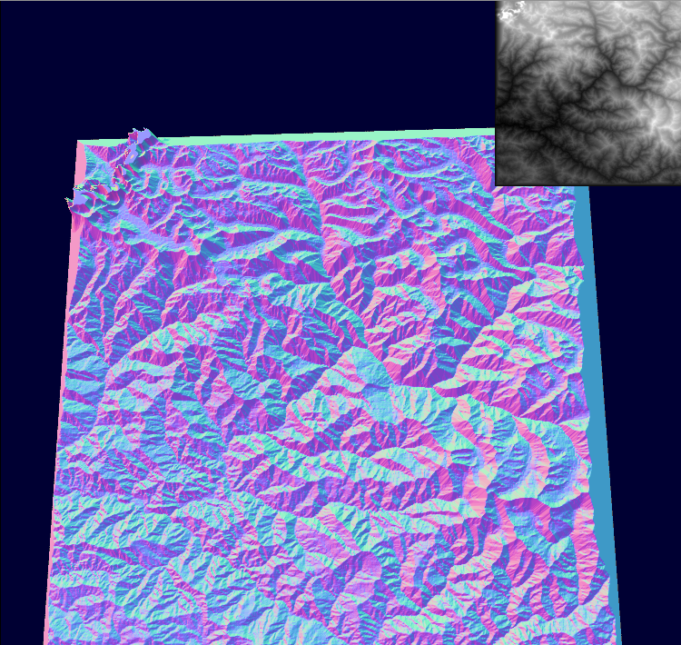

# Interactive Erosion Simulation in WebGPU
Authors: [Utkarsh Dwivedi](https://linkedin.com/in/udwivedi/), [Saksham Nagpal](https://www.linkedin.com/in/nagpalsaksham/), [Linda Zhu](https://www.linkedin.com/in/lindadaism/)

**TerrainX** is an implementation of the paper [Large-scale terrain authoring through interactive erosion simulation](https://hal.science/hal-04049125) published on 28th July 2023 that aims to combine interactive large-scale terrain authoring with geomorphologically accurate erosion simulation.

## **[Click here for a Live Demo!](https://gpu-gang.github.io/WebGPU-Erosion-Simulation/)**

## Parallelized Stream Power Erosion
To address the incremental and interactive resolution of the stream power equation, the authors address the most computationally expensive aspect of solving this equation - the drainage area. The authors propose a parallel approximation of the drainage area that results in a fast convergence rate for the stream power equation. We started off by writing a **compute shader** that simulates this approximated version of the equation, and our result was as follows:  

## Raymarched Terrain
To visualise the 3d terrain based on the computed height map, we follow the author's approach of employing sphere tracing, and the results looked like this:  
|  |  | 
|:--:|:--:|
| *Normals as color* | *Lambertian Shading* |

## Interactive Authoring
One of the main goals of the paper is to bridge the gap between interactive terrain authoring with geomorpholigcally accurate erosion simulation. For this, they present several tools, of which we formulated a subset:

### 1. Terrain Painting Tool
Users can use `Ctrl + Mouse-Click` and drag the mouse to uplift the terrain by the required amount driven by the `brushStrength` parameter within a certain radius driven off of the `brushRadius parameter`.  
  

### 2. Terrain Erasing Tool
Using the same controls as the painting tool, users can toggle to erase the terrain instead by checking the `eraseTerrain` option on the GUI.  
  

### 4. Texture-based Brush Tool
Checkcing the `customBrush` box will enable users to paint and erase using a texture-based brush. The `brushScale` then represents the different mipmap levels of the original texture, resulting in a smaller brush size with a higher `brushScale`.
  

## Real-World Data Integration
After establishing a usable model based on the paper, we wanted to see its applicability using some real world data. We used [Earth Explorer](https://earthexplorer.usgs.gov/) to get the height field for a certain part of the world. [This](https://www.youtube.com/watch?v=kEgijZUKMGc) video was a helpful walkthrough that showed us how we could use Earth Explorer to get the required height maps.

* ### Proof of Concept
First, we select a section of the terrain on Earth Explorer whose data we want to retrieve. We selected a section of the Himalayas:  
  

Next, Earth Explorer shows the sections for which data is available and chops it up into individual textures of **1201X1201 pixels**. We selected the one shown below:  
  
  

Finally, we use this texture in our application, and we can see a visaulization of the Himalayas based on the Height Map used and running at a solid 80+ FPS:  
 
 

## Building
`webgpu-erosion-simulation` is built with [Typescript](https://www.typescriptlang.org/)
and compiled using [Next.js](https://nextjs.org/). Building the project
requires an installation of [Node.js](https://nodejs.org/en/).

- Install dependencies: `npm install`.
- For development, start the dev server which will watch and recompile
  sources: `npm start`. You can navigate to http://localhost:3000 to view the project.
- To compile the project: `npm run build`.

## Credits

- 3d-view-controls npm package