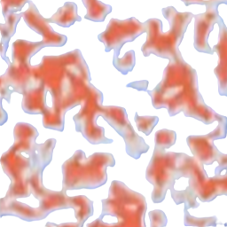
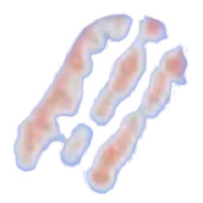
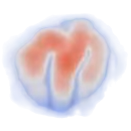
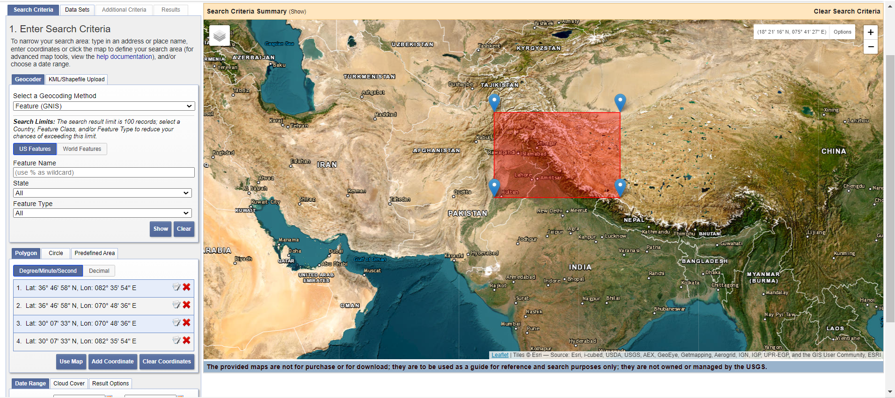
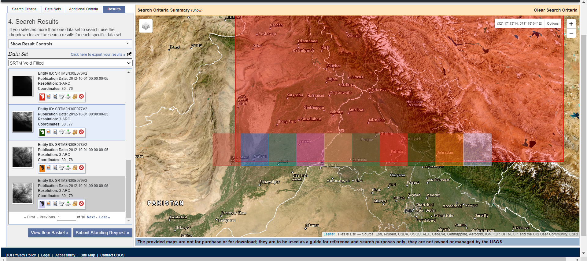
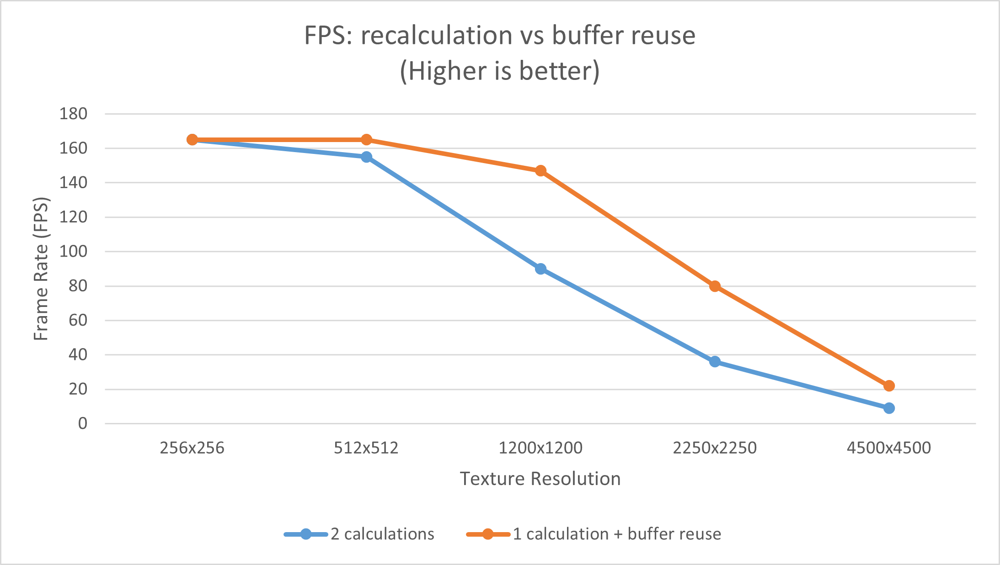
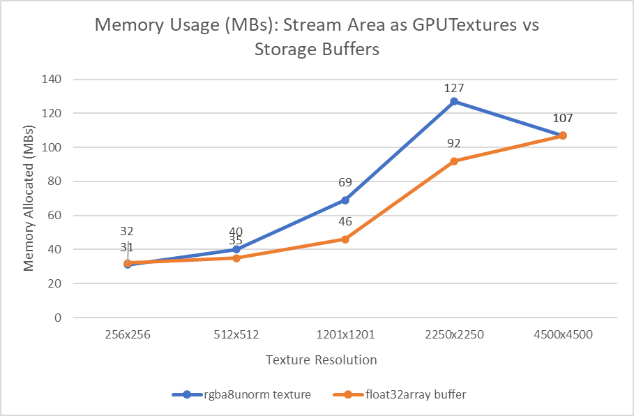
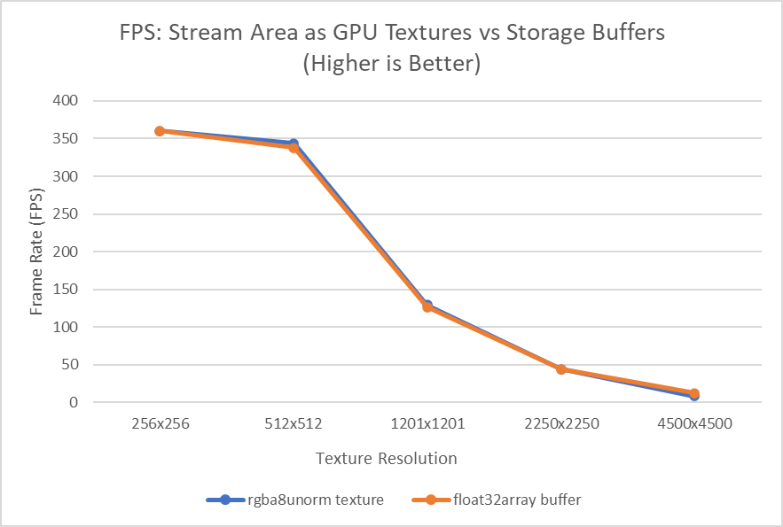

# Interactive Erosion Simulation in WebGPU
Authors: [Utkarsh Dwivedi](https://linkedin.com/in/udwivedi/), [Saksham Nagpal](https://www.linkedin.com/in/nagpalsaksham/), [Linda Zhu](https://www.linkedin.com/in/lindadaism/)

**TerrainX** is an implementation of the paper [Large-scale terrain authoring through interactive erosion simulation](https://hal.science/hal-04049125) published on 28th July 2023 that aims to combine interactive large-scale terrain authoring with geomorphologically accurate erosion simulation.

## **[Click here for a Live Demo!](https://gpu-gang.github.io/WebGPU-Erosion-Simulation/)**

## Table of Contents
1. [Parallelized Stream Power Erosion](#parallelized-stream-power-erosion)
2. [Raymarched Terrain](#raymarched-terrain)
3. [Interactive Authoring](#interactive-authoring)
   * [1. Terrain Painting Tool](#1-terrain-painting-tool)
   * [2. Terrain Erasing Tool](#2-terrain-erasing-tool)
   * [3. Texture-based Brush Tool](#3-texture-based-brush-tool)
   * [4. Uploading Custom Height Map](#4-uploading-custom-height-map)
4. [Real-World Data Integration](#real-world-data-integration)
5. [Performance Analysis](#performance-analysis)
   * [1. Finding a good workgroup size](#1-finding-a-good-workgroup-size)
   * [2. Steepest flow recalculation vs buffer](#2-steepest-flow-recalculation-vs-buffer)
   * [3. `textureSample` vs `textureSampleLevel`](#3-texturesample-vs-texturesamplelevel)
   * [4. Both optimizations combined](#4-both-optimizations-combined)
   * [5. Render Bundles](#5-render-bundles)
   * [6. Stream Area Storage Buffers](#6-stream-area-storage-buffers)
   * [7. \[Unused\] Parallel Reduction](#7-unused-parallel-reduction)
6. [Building](#building)
7. [Milestones](#milestones)
8. [Credits](#credits)

## Parallelized Stream Power Erosion
To address the incremental and interactive resolution of the stream power equation, the authors address the most computationally expensive aspect of solving this equation - the drainage area. The authors propose a parallel approximation of the drainage area that results in a fast convergence rate for the stream power equation. We started off by writing a **compute shader** that simulates this approximated version of the equation, and our result was as follows:  

## Raymarched Terrain
To visualise the 3d terrain based on the computed height map, we follow the author's approach of employing sphere tracing, and the results looked like this:  
|  |  | 
|:--:|:--:|
| *Normals as color* | *Lambertian Shading* |

## Interactive Authoring
One of the main goals of the paper is to bridge the gap between interactive terrain authoring with geomorpholigcally accurate erosion simulation. For this, they present several tools, of which we formulated a subset:

### 1. Terrain Painting Tool
Users can use `Ctrl + Mouse-Click` and drag the mouse to uplift the terrain by the required amount driven by the `brushStrength` parameter within a certain radius driven off of the `brushRadius parameter`.  
  

### 2. Terrain Erasing Tool
Using the same controls as the painting tool, users can toggle to erase the terrain instead by checking the `eraseTerrain` option on the GUI.  
  

### 3. Texture-based Brush Tool
Checkcing the `customBrush` box will enable users to paint and erase using a texture-based brush. The reference textures are color gradient that comes from the original paper's demo video. We sample the `g` channel value to add onto the terrain's uplift map. You can recognize the pattern of the original texture based on the brush shape.

The `brushScale` represents the different mipmap levels of the original texture. Due to the inverse correlation between mip level and texture size, i.e. the smaller the mip level, the bigger the texture, at backend we calculate `brushScale = MAX_SIZE - totalMipCount` such that at mip level=0, the brush size is the biggest in "scale".

| Pattern 1 | Pattern 2 | Pattern 3 |
|:-:|:-:|:-:|
||||

### 4. Uploading Custom Height Map  
While our application provides some basic height maps to play around with, the user can also upload their own height map if needed by using the `Upload Custom Height Map` button on the GUI controls:  
   
Once a user clicks on the button, a file upload dialogue pops up and the user can select any height map of their choice:  
  
Once selected, the height map name is reflected on the GUI name placeholder and the erosion simulation picks up the custom height map:  
  

## Real-World Data Integration
After establishing a usable model based on the paper, we wanted to see its applicability using some real world data. We used [Earth Explorer](https://earthexplorer.usgs.gov/) to get the height field for a certain part of the world. [This](https://www.youtube.com/watch?v=kEgijZUKMGc) video was a helpful walkthrough that showed us how we could use Earth Explorer to get the required height maps.

* ### Proof of Concept
First, we select a section of the terrain on Earth Explorer whose data we want to retrieve. We selected a section of the Himalayas:  
  

Next, Earth Explorer shows the sections for which data is available and chops it up into individual textures of **1201X1201 pixels**. We selected the one shown below:  
  
  

Finally, we use this texture in our application, and we can see a visaulization of the Himalayas based on the Height Map used and running at a solid 80+ FPS:  
 
 

## Performance Analysis

### 1. Finding a good workgroup size

*Performance data captured on Windows 11 Home, AMD Ryzen 7 5800H @ 3.2GHz 16 GB, Nvidia GeForce RTX 3060 Laptop GPU 6 GB, running on Google Chrome*

For analysing the impact of workgroup size on performance, a 2250x2250 texture was used with varying workgroup sizes.

| FPS vs workgroup size |
|:-:|
||

8x8 is the optimal workgroup size, as there are no performance gains after that. This is the workgroup size used for the rest of the analysis.

### 2. Steepest flow recalculation vs buffer

*Performance data captured on Windows 11 Home, AMD Ryzen 7 5800H @ 3.2GHz 16 GB, Nvidia GeForce RTX 3060 Laptop GPU 6 GB, running on Google Chrome*

The steepest flow for the erosion is calculated not once, but twice, for each pixel. This calculation involves sampling a the neighbours of the current pixel in a `25x25` matrix area. This becomes costly with increasing texture resolutions.

Calculating this steepest flow only once, and then storing it in a buffer for reuse later, boosts performance significantly. This performance boost is more apparent with higher resolution textures, as with lower resolution textures the **total** number of neighbourhood samples across all pixels during a frame are not very high.

| FPS: Steepest flow calculation optimisation using storage buffer | Memory Usage: Steepest flow optimisation using storage buffer |
|:-:|:-:|
|||

This does have an impact on memory with greater texture sizes (due to the additional steepest flow buffer), but this is acceptable for the performance gains.

### 3. `textureSample` vs `textureSampleLevel`

*Performance data captured on Windows 11 Home, AMD Ryzen 7 5800H @ 3.2GHz 16 GB, Nvidia GeForce RTX 3060 Laptop GPU 6 GB, running on Google Chrome*

Our first iteration of the terrain rendering using raymarching used `textureSample`.

`textureSample` requires texture sampling to happen in uniform control flow. This means that the terrain raymarching could not use bounding box optimisations to only sample the heightfield when the ray hit the bounding box of the terrain. The texture needed to be sampled for every ray (every pixel!) and every frame. This also meant that many calculations that should only happen when the ray actually hit the terrain, were happening at all times. This slowed down performance significantly!

`textureSampleLevel` is hardware accelerated, and does not have the same uniform control flow requirement as `textureSample`. After making these changes we noticed significant performance boosts.

| FPS: Axis-Aligned Bounding Box optimisations |
|:-:|
||

### 4. Both optimizations combined

While both the steepest flow buffer and bounding box optimisations improve performance, their real benefit shows when both are combined.

| FPS: both optimisations |
|:-:|
||

We're able to get ~40 fps on the web even with 4.5k size textures when both these optimisations are enabled!

### 5. Render Bundles
[Brandon Jones](https://toji.dev/) has a great artice on [WebGPU Render Bundles](https://toji.dev/webgpu-best-practices/render-bundles), and had talked about the same in his [guest lecture](https://docs.google.com/presentation/d/1AUfD0xq5GG3SwIoG8JricAzhpHnmTt90MMl-TodWXxU/edit?usp=sharing) for our class [CIS 5650 GPU Programming Fall 2023](https://cis565-fall-2023.github.io/). According to the article, Render Bundles can assist with CPU-side optimizations by reducing the overhead with a large number of repeated Javascript calls. Although majority of our project has its processing being performed on the GPU side, we wanted to see if Render Bundles would affect our performance in any way or not. Rendering using Render Bundles can be toggled ON/OFF by using the `Use Render Bundles` checkbox on the UI:  
    
A performance comparison with/without using Render Bundles for our application across varying texture resolutions yielded the following result:  
| FPS: With VS Without Render Bundles |
|:-:|
||  

As expected, we do not see any major performance improvement using Render Bundles as our application seems to be GPU bound whereas Render Bundles shine only with the CPU-side optimizations. In fact, on a high resolution 4K texture, Render Bundles seem to take a slight hit for our use case. We also asked about the same in the [WebGPU Matrix Chat](https://app.element.io/#/room/#WebGPU:matrix.org) and our theory was corroborated with the same explanation in [this thread](https://matrix.to/#/!MFogdGJfnZLrDmgkBN:matrix.org/$eLFWiqHVSwE-cXySXl89gQ6iAbSkofi7CXLS3NJzzOw?via=matrix.org).

### 6. Stream Area Storage Buffers

*Performance data captured on Windows 11, Intel i7-12800H @ 2.40GHz 16GB, NVIDIA GeForce RTX 3070 Ti, running on Google Chrome*

In our compute pass, we have three pairs of ping-pong buffers for different data: heightfields, uplifts and stream area. These ping-pong buffers are all storage textures, which means that they have to be in `rgba8unorm` format to be able to use the `GPUTextureUsage.STORAGE_BINDING` flag. However, most of our inputs only have greyscale values. It would be wasteful to utilize only one channel, i.e. `r`, out of four `rgba` while going through frequent texture binding for ping-ponging. In theory, we only need an array of floats to hold the greyscale values for better memory usage, and that matches perfectly the concept of storage buffer in WebGPU. 

We tried switching to use storage buffers for stream area because streams is the only data that's not impacted by GUI, i.e. no runtime change, and not used for any rendering stages, thus more manageable when it comes to refactoring. We ran both methods, stream area in `rgba8unorm` format GPUTextures and storage buffers in `array<f32>`, on various texture resolutions to see if the latter optimizes performance.

| Memory Usage | FPS |
|:-:|:-:|
|||

As we can see from above charts, there is no big difference in FPS because changing the data structure mainly impacts on how we are storing the data, not how we are computing the data. Regarding the allocated memory, it is evident that as texture resolution increases, storage buffer in general does save more memory. The reason for the exception at 4K is unclear but my guess is either due to the `stats-js` library we use or some Chrome broswer setting.

Note that the memory allocation here is at peak usage. No matter what heightfield and uplift resolution combination we have, eventually the memory usage all drops to ~30 MBs because of simulation convergence.

### 7. [Unused] Parallel Reduction

*Performance data captured on Windows 11 Home, AMD Ryzen 7 5800H @ 3.2GHz 16 GB, Nvidia GeForce RTX 3060 Laptop GPU 6 GB, running on Google Chrome*

There is an unused implementation of parallel reduction in the branch `fixHeightrange`. This is used to calculate the highest height across all pixels in the heightfield. We compare a simple CPU side version of this to the parallel reduction version of this. None of the other optimisations mentioned above were active during this analysis. This parallel reduction is unused because the need to use this calculation was made redundant during a different change in the project.

| FPS: CPU calculation vs parallel reduction |
|:-:|
||

It is evident that parallel reduction is significantly faster for texture resolutions up until 2k textures. Around 4.5k texture resolution the benefits gained from parallel reduction are not enough by themselves, and must be combined with other optimisations mentioned above.

## Building
`webgpu-erosion-simulation` is built with [Typescript](https://www.typescriptlang.org/)
and compiled using [Next.js](https://nextjs.org/). Building the project
requires an installation of [Node.js](https://nodejs.org/en/).

- Install dependencies: `npm install`.
- For development, start the dev server which will watch and recompile
  sources: `npm start`. You can navigate to http://localhost:3000 to view the project.
- To compile the project: `npm run build`.

## Milestones
Below are the documents that keep track of our work progress for each milestone. Each milestone is roughly one week.

- [Project Pitch](https://docs.google.com/presentation/d/1U9Y6VFECVfn6mhUaep0t8t0P2r_0T2RTsyhgKOdf2Uo/edit?usp=sharing)
- [Milestone 1](https://docs.google.com/presentation/d/1mvhx0vmb0wWAKpwc3DHh_c5nZlIF8H73mfBeCfG6G60/edit?usp=sharing)
- [Milestone 2](https://docs.google.com/presentation/d/1C4qWtwdL7sbG5eAwLpGSHp0eiF81LRQnO8A8Re6JLIo/edit?usp=sharing)
- [Milestone 3](https://docs.google.com/presentation/d/1gfsFAKoRThtx8gYg_nAFOLUSUEzy8BMcRmjuyRnvBGs/edit?usp=sharing)
- [Final Presentation](https://docs.google.com/presentation/d/1iHTUyID65ToaZNYz_6zfF5gauFlRNPHl7nhCTE8f3ck/edit?usp=sharing)

## Credits

- Authors of [Large-scale terrain authoring through interactive erosion simulation](https://hal.science/hal-04049125)
- [WebGPU Samples](https://webgpu.github.io/webgpu-samples/)
- [3d-view-controls npm package](https://www.npmjs.com/package/3d-view-controls)
- [WebGPU Matrix Chat](https://app.element.io/#/room/#WebGPU:matrix.org)
- [Brandon Jones](https://toji.dev/)
- [WebGPU - All of the cores, none of the canvas](https://surma.dev/things/webgpu/) - article on compute shaders in WebGPU by Surma
- [WebGPU Fundamentals](https://webgpufundamentals.org/)
- [WebGPU Manual](https://www.w3.org/TR/webgpu/)
